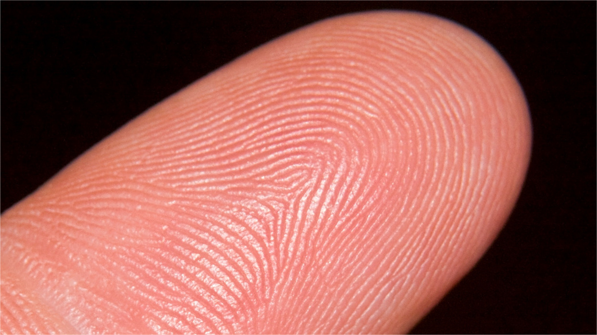

# Fingerprint Image Enhancement Using OpenCV

[](https://travis-ci.org/jjerphan/Fingerprint_Image_Enhancement)

A C++ implementation of the enhancement method based on Anil Jain's paper:

*Fingerprint Image Enhancement: Algorithm and Performance Evaluation*, *IEEE Transactions on Pattern Analysis and Machine Intelligence*, vol. 20, No. 8, August, 1998. This paper is readable [here](https://www.google.fr/url?sa=t&rct=j&q=&esrc=s&source=web&cd=3&cad=rja&uact=8&ved=0ahUKEwjZgPWX5bTYAhWHblAKHTteCPUQFghFMAI&url=http%3A%2F%2Fwww.math.tau.ac.il%2F~turkel%2Fimagepapers%2Ffingerprint.pdf&usg=AOvVaw35b-7mvIizEjNnV54_rrRq).

## Overview
This program is using OpenCV 2.4.10 and program performs respectively :
 - the image normalization,
 - the image orientation calculation
 - a Gabor filter based image enhancement
 - a cropping to only get the fingerprints

## How to use

Install OpenCV on your machine. Then:

```bash 
git clone git@github.com:jjerphan/Fingerprint_Image_Enhancement.git
cd Fingerprint_Image_Enhancement
mkdir -p build
cmake ..
make
```

You can then execute the script on a picture :
```bash
./fingerprint -i input.png
```

## Example of result
Here is an input image :



and the results obtained by running the command above:


You need to manually save the image shown in the OpenCV window at the end.

Best,

Ekberjan, Baptiste Amato and Julien Jerphanion.


## License

This project is distributed under the BSD 3-clause license.